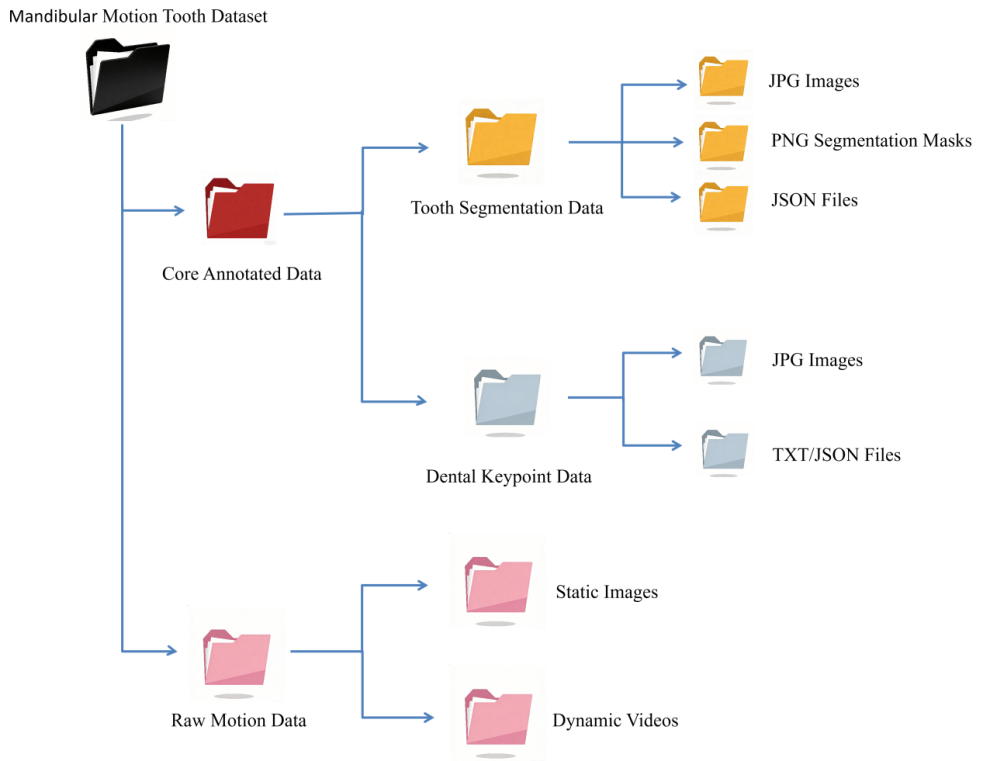

# Mandibular Motion Tooth Dataset
A publicly available dental dataset containing 27 mandibular movement videos and over 1,200 manually annotated oral images, along with benchmark evaluations using mainstream segmentation and keypoint detection methods.

---

## 📊 Dataset Information

* **Total images:** 1200
* **Keypoints per image:** 35
* **Annotation formats:** COCO-style JSON and TXT
* **Train/Validation split:** 80% / 20%

---

## Data Structure

The following diagram shows the data structure used in this project:

---

## 📥 Download

The full dataset is available on Zenodo:

👉 [https://doi.org/10.5281/zenodo.19146909](https://doi.org/10.5281/zenodo.19201948)

---

## 🧠 Applications

This dataset can be used for:

* Dental keypoint detection
* Landmark localization
* Mandibular motion analysis
* Medical image understanding
* Deep learning model training

---

## 📄 License

This dataset is released under the **Creative Commons Attribution 4.0 International (CC BY 4.0)** License.

---
